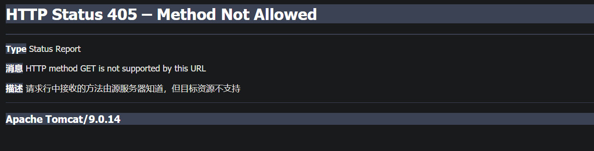

# 第6章 Servlet技术

## Servlet概述
```aidl

```


## 创建servlet类
```aidl
import org.junit.Test;

import javax.servlet.ServletException;
import javax.servlet.http.HttpServlet;
import javax.servlet.http.HttpServletRequest;
import javax.servlet.http.HttpServletResponse;
import javax.sql.rowset.serial.SerialException;
import java.io.IOException;

/**
 * @author Alexander Jiajiason
 * @date 2019-05-25 13:21
 */

public class test1 extends HttpServlet {
    public test1() {
        super();
    }

    public void init() throws ServletException {
        super.init();
    }

    public void doGet(HttpServletRequest req, HttpServletResponse resp) throws ServletException, IOException {
        super.doGet(req, resp);
    }

    public void doPost(HttpServletRequest req, HttpServletResponse resp) throws ServletException, IOException {
        super.doPost(req, resp);
    }

    public void doPut(HttpServletRequest req, HttpServletResponse resp) throws ServletException, IOException {
        super.doPut(req, resp);
    }

    public void destroy() {
        super.destroy();
    }
}

```


##配置servlet相关的元素(web.xml)
```aidl
<servlet>
        <servlet-name>test1</servlet-name>
        <servlet-class>test1</servlet-class>
    </servlet>
    <servlet-mapping>
        <servlet-name>test1</servlet-name>
        <url-pattern>/servlet/test1</url-pattern>
    </servlet-mapping>
```

##运行结果


